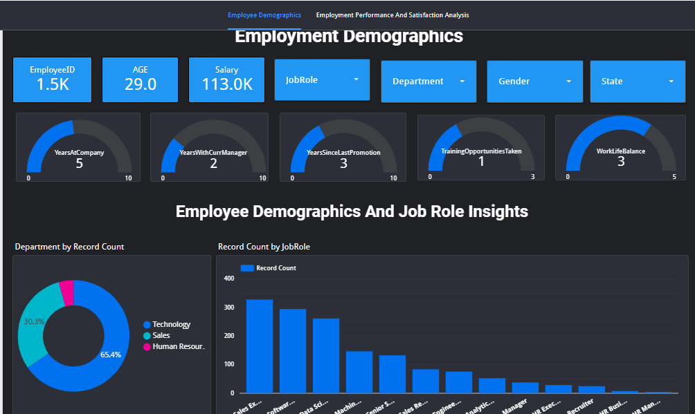
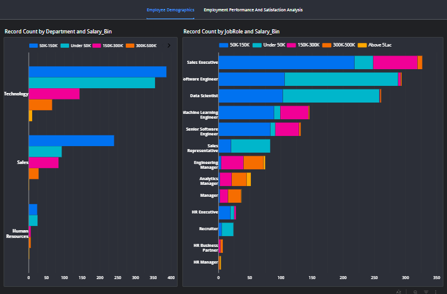
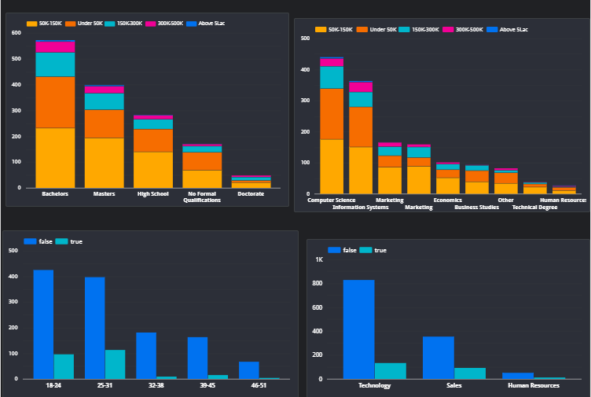
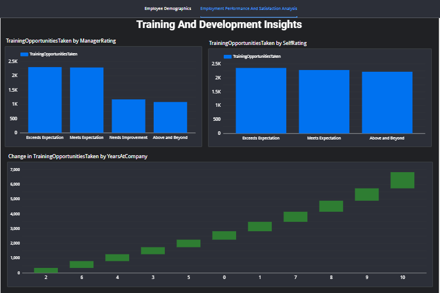
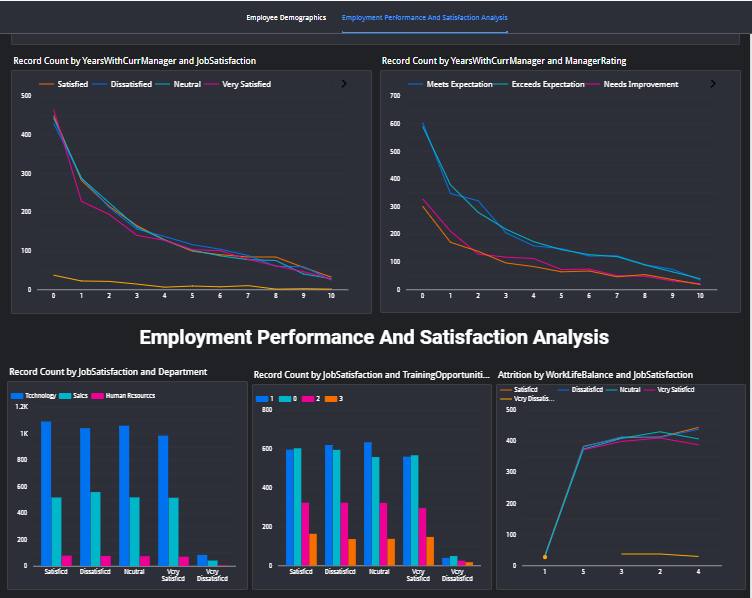
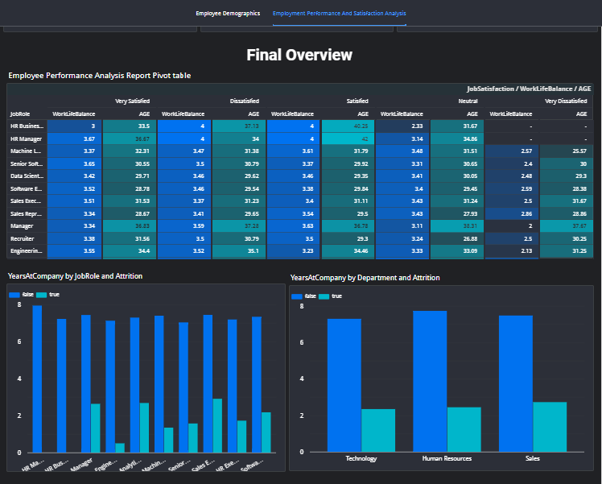

# Workforce Analytics Pipeline
### Google BigQuery + Looker Studio

> An end-to-end employee analytics pipeline built on Google BigQuery, transforming raw HR data across multiple relational tables into clean, analysis-ready datasets and an interactive Looker Studio dashboard.

---

## Tech Stack

| Tool | Purpose |
|------|---------|
| **Google BigQuery** | Cloud data warehouse, SQL transformations, table creation |
| **SQL** | Data cleaning, feature engineering, joins, CASE logic |
| **Looker Studio** | Interactive dashboard and KPI visualization |

---

### Dashboard Preview

## Looker Studio Dashboard

[View Live Dashboard](https://lookerstudio.google.com/reporting/395a29fe-395b-4b51-ad7f-3fa757cc31b6) 

The dashboard connects directly to the BigQuery tables and provides interactive filtering across all key dimensions.

## Dataset Overview

The raw data consists of **5 relational tables** stored in BigQuery:

| Table | Description |
|-------|-------------|
| `Employee` | Core employee demographics, job info, salary, attrition |
| `EducationLevel` | Lookup table mapping education IDs to level names |
| `PerformanceRate` | Performance review records per employee |
| `RatingLevel` | Lookup table mapping rating IDs to rating labels |
| `SatisfiedLevel` | Lookup table mapping satisfaction IDs to satisfaction labels |

---

## SQL Transformations (Google BigQuery)

All transformations were written and executed directly in **Google BigQuery**. The pipeline is split across three query files:

### 1. Employee Table Transformations
[View Query File](https://console.cloud.google.com/bigquery?sq=751677918605:2db3bbf784cb4d05ae283661c133722a) 

Covers all feature engineering on the `Employee` table and creates `table1` — the primary analytical table. Key operations include:
- `JOIN` with `EducationLevel` lookup table to resolve education codes into readable labels
- Inline `CASE` statements to engineer **age bands**, **salary tiers**, and **state name mappings**
- `CONCAT` to standardize employee full name formatting
- `CREATE TABLE` to persist the enriched dataset as a reusable analytical table in BigQuery

### 2. Performance & Satisfaction Table
[View Query File](https://console.cloud.google.com/bigquery?sq=751677918605:83ae93aae3814253bb6baef775dac1fb)

Creates `table2` by resolving all categorical IDs in the performance data into human-readable labels. Key operations include:
- **Self-join pattern**: `RatingLevel` joined **twice** (different aliases) to independently resolve `SelfRating` and `ManagerRating` from the same lookup table
- **Triple join on same table**: `SatisfiedLevel` joined **three times** to separately resolve Environment, Job, and Relationship satisfaction dimensions
- All raw IDs replaced with descriptive labels for direct downstream reporting use

### 3. Data Quality Checks
[View Query File](https://console.cloud.google.com/bigquery?sq=751677918605:1b8699d2bc194fc28af492b2c47df118)

Structured validation queries run against both `table1` and `table2` after creation:
- **Null checks** across all columns using `IS NULL` conditions
- **Duplicate checks** using `GROUP BY` + `HAVING COUNT(*) > 1` on primary keys (`EmployeeID`, `PerformanceID`)

> Both tables returned 0 nulls and 0 duplicates — confirming clean, report-ready data.

---

### KPI Scorecards
| Metric | Value |
|--------|-------|
| Total Employees | 1,500 |
| Average Age | 29 |
| Average Salary | $113K |
| Avg Years at Company | 5 |
| Avg Work-Life Balance | 3/5 |

### Visualizations Included
- **Department distribution** — Donut chart (Technology 65.4%, Sales 30.3%, HR 4.3%)
- **Job Role by headcount** — Bar chart across 13 roles
- **Salary distribution by Department, Job Role, Education Field & Level** — Stacked bar charts
- **Attrition by Age Group and Department** — Bar charts with true/false split

### Dashboard Filters
- Job Role · Department · Gender · State

## Key Insights

- **Technology dominates headcount** at 65.4%, with Sales Executives being the largest single job role
- **Majority of employees fall in the 50K–150K salary band**, with senior roles showing higher salary tier concentrations
- **Attrition is highest in the 18–24 age group**, suggesting early-career turnover risk
- **Average work-life balance of 3/5** and training opportunities taken of 1 point to potential engagement improvement areas

